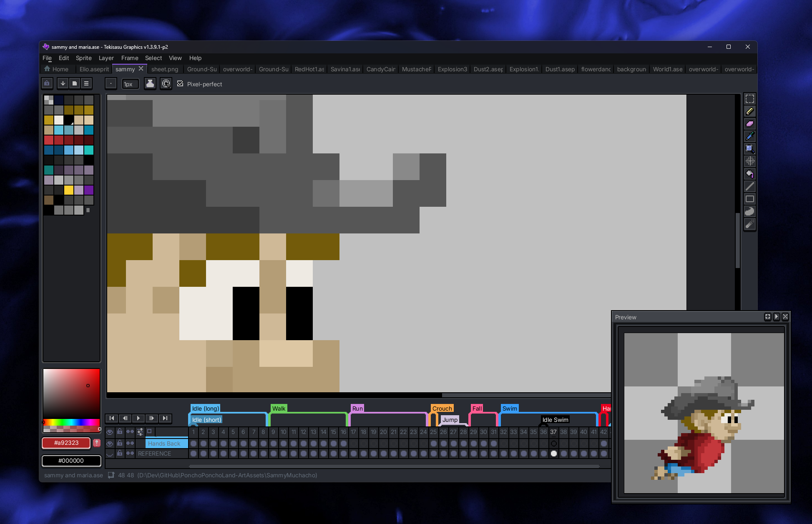

# Tekisasu Graphics

We maintain a private modification of [Aseprite](https://github.com/aseprite/aseprite) tailored for the Tekisasu Engine pipeline.

## 🎨 What We Do

Tekisasu Graphics provides customized default export options, themes, and workflow enhancements specifically designed for game development with the Tekisasu Engine. Our modifications streamline the asset creation process for pixel art games.

## 📜 Important Licensing Notice

**Source Code Only**: In compliance with Aseprite's licensing requirements, we only distribute source code publicly. Compiled binaries of Aseprite or its derivatives cannot be publicly shared.

To use Tekisasu Graphics, you must build it from source. Build instructions are available in the main repository.

## 🔗 Getting Started

Check out our repositories to explore the modifications and build from source!
